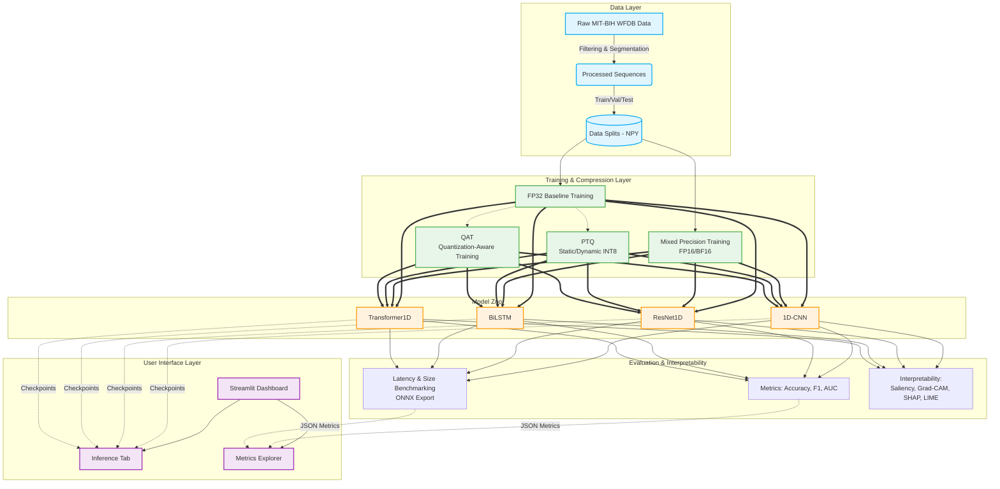
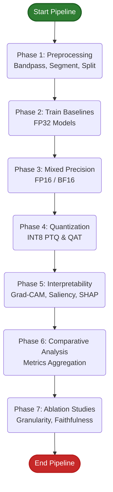
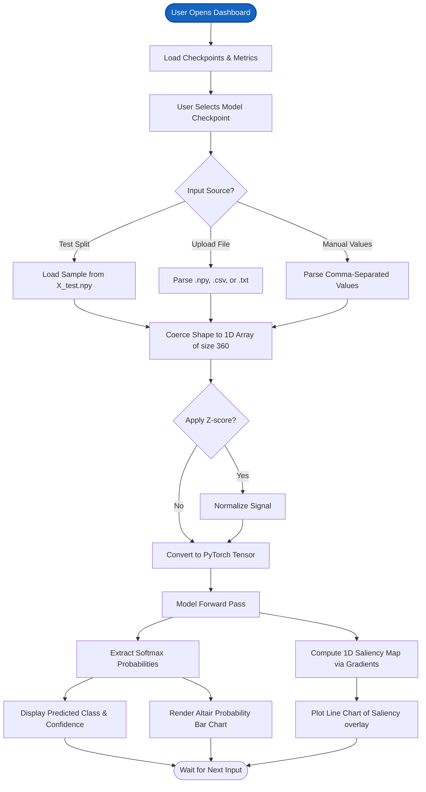

# ECG Project Architecture and Flowcharts

This document outlines the high-level architecture of the ECG Arrhythmia Intelligence system and the execution flow of the project's components.

## Overall System Architecture

The overall architecture demonstrates how raw data is transformed, used to train various uncompressed and compressed models, evaluated on edge-like conditions, and finally served via a Streamlit interface.

---

## 1. Core Pipeline Flowchart (`run_all.py`)

This flowchart illustrates the sequence of operations for model training, optimization, and evaluation.

---

## 2. Streamlit Dashboard Inference Flow

This flowchart breaks down how a user's input gets processed and visualized in the live Streamlit Dashboard (`streamlit_dashboard.py`).

